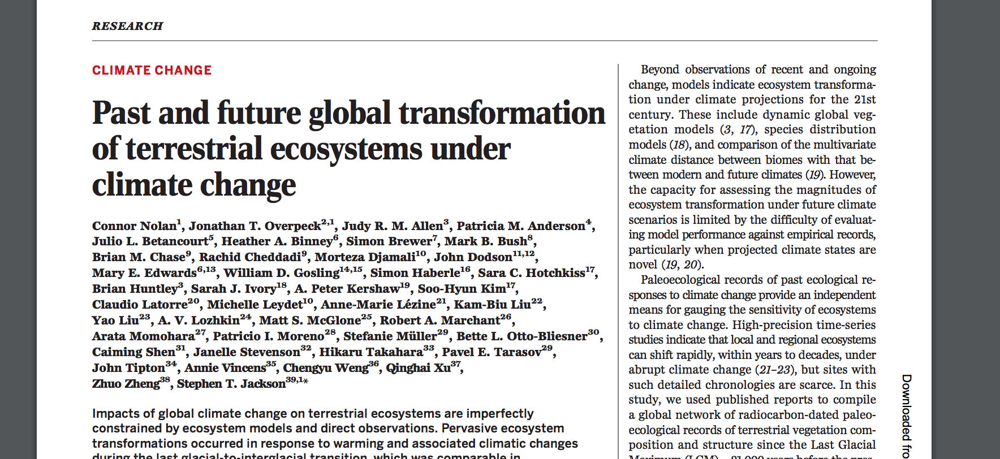
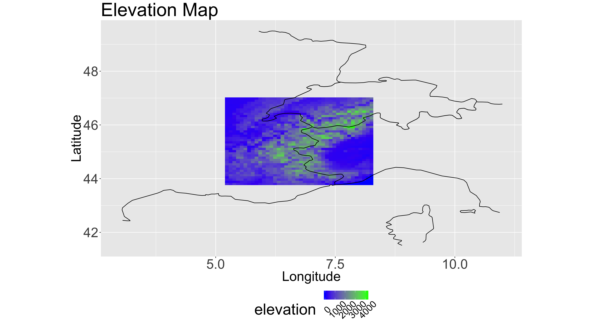
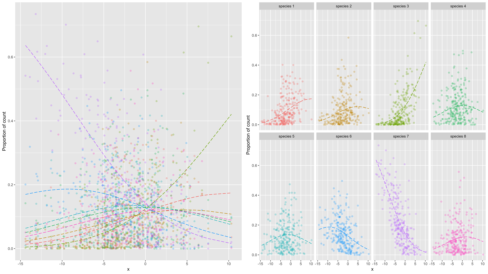
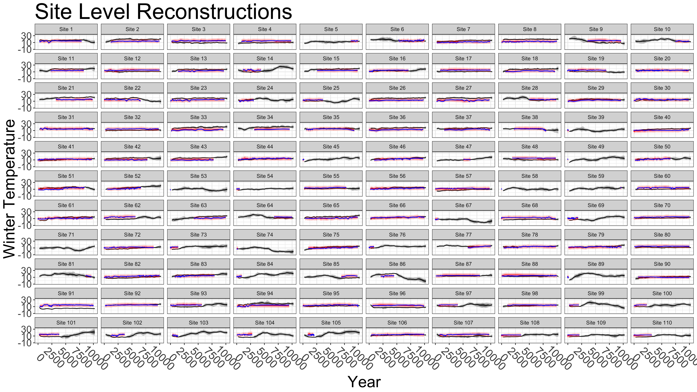

```{r setup, include=FALSE}
library(ggplot2)
library(here)
library(knitr)
library(BayesComposition)
library(fields)
knitr::opts_chunk$set(echo = FALSE, 
                      fig.align="center",
                      out.width = "85%", 
                      fig.width = 16,
                      fig.height = 9)
```

# University of Arkansas Statistics Seminar

## Introduction 

> * Climate change is well understood globally.

> * Climate change is less well understood locally.

> * Need for spatailly explicit reconstructions of climate variables.

> * Problem: data souruces are messy and noisy.

## Introduction | Predicting the future by learning from the past

```{r}
# knitr::include_graphics(here("images", "Science.png"))

```

## Introduction | Predicting the future by learning from the past

```{r}
knitr::include_graphics(here("images", "past1.png"))
```

## Introduction | Predicting the future by learning from the past

```{r}
knitr::include_graphics(here("images", "past2.png"))
```

## Introduction | Predicting the future by learning from the past

```{r, out.width="50%"}
knitr::include_graphics(here("images", "future.png"))
```

# Learning about the past

## Climate proxy data

> * Many ecological and phyiscal processes respond to climate over different time scales.
>     * Tree rings, corals, forest landscapes, ice rings, lake levels, etc.

<br />

> * These processes are called **climate proxies**.
>     * They are proxy measurements for unobserved climate.
>     * Noisy and messy.
>     * Respond to a wide variety of non-climatic signals.

# Pollen Data 

## Pollen Data

```{r, out.width='95%', echo=FALSE}
knitr::include_graphics(here("images", "pollen.png"))
```

## Pollen Data 

```{r, out.width='95%', echo=FALSE}
knitr::include_graphics(here("images", "pollen-locations.png"))
```

## Fossil Pollen Data 

```{r, out.width='95%', echo=FALSE}
knitr::include_graphics(here("images", "fossil-pollen-locations.png"))
```


## Model Framework

* <p>
  <span> Bayesian hierarchical model. </span>
</p>

$\begin{align*}
[\mathbf{Z}, \boldsymbol{\theta}_D, \boldsymbol{\theta}_P | \mathbf{y}] & \propto 
[\mathbf{y} | \boldsymbol{\theta}_D, \mathbf{Z}]  [\mathbf{Z} | \boldsymbol{\theta}_P] [\boldsymbol{\theta}_D] [\boldsymbol{\theta}_P]
\end{align*}$

<p>
  <span>  </span>
</p>

## Model Framework

* <p>
  <span> Bayesian hierarchical model. </span>
</p>

$\begin{align*}
\color{cyan}{[\mathbf{Z}, \boldsymbol{\theta}_D, \boldsymbol{\theta}_P | \mathbf{y}]} & \propto 
[\mathbf{y} | \boldsymbol{\theta}_D, \mathbf{Z}]  [\mathbf{Z} | \boldsymbol{\theta}_P] [\boldsymbol{\theta}_D] [\boldsymbol{\theta}_P]
\end{align*}$

* <p>
  <span style="color: #00ffff"> Posterior. </span>
</p>


## Model Framework

* <p>
  <span> Bayesian hierarchical model. </span>
</p>

$\begin{align*}
\color{cyan}{[\mathbf{Z}, \boldsymbol{\theta}_D, \boldsymbol{\theta}_P | \mathbf{y}]} & \propto 
\color{red}{[\mathbf{y} | \boldsymbol{\theta}_D, \mathbf{Z}]}  [\mathbf{Z} | \boldsymbol{\theta}_P] [\boldsymbol{\theta}_D] [\boldsymbol{\theta}_P]
\end{align*}$

* <p>
  <span style="color: #00ffff"> Posterior. </span>
</p>

* <p>
  <span style="color: #ff0000"> Data Model</span>
</p>

## Model Framework

* <p>
  <span> Bayesian hierarchical model. </span>
</p>

$\begin{align*}
\color{cyan}{[\mathbf{Z}, \boldsymbol{\theta}_D, \boldsymbol{\theta}_P | \mathbf{y}]} & \propto 
\color{red}{[\mathbf{y} | \boldsymbol{\theta}_D, \mathbf{Z}]}  \color{blue}{[\mathbf{Z} | \boldsymbol{\theta}_P]} [\boldsymbol{\theta}_D] [\boldsymbol{\theta}_P]
\end{align*}$

* <p>
  <span style="color: #00ffff"> Posterior. </span>
</p>

* <p>
  <span style="color: #ff0000"> Data Model. </span>
</p>

* <p>
  <span style="color: #0000ff"> Process Model. </span>
</p>

## Model Framework

* <p>
  <span> Bayesian hierarchical model. </span>
</p>

\definecolor{tangerine}{RGB}{0.95, 0.52, 0.0}

$\begin{align*}
\color{cyan}{[\mathbf{Z}, \boldsymbol{\theta}_D, \boldsymbol{\theta}_P | \mathbf{y}]} & \propto 
\color{red}{[\mathbf{y} | \boldsymbol{\theta}_D, \mathbf{Z}]}  \color{blue}{[\mathbf{Z} | \boldsymbol{\theta}_P]} \color{orange}{[\boldsymbol{\theta}_D] [\boldsymbol{\theta}_P]}
\end{align*}$

* <p>
  <span style="color: #00ffff"> Posterior. </span>
</p>

* <p>
  <span style="color: #ff0000"> Data Model. </span>
</p>

* <p>
  <span style="color: #0000ff"> Process Model. </span>
</p>

* <p>
  <span style="color: #ff7f00"> Prior Model. </span>
</p>

# Data Model

$\begin{align*}
[\mathbf{Z}, \boldsymbol{\theta}_D, \boldsymbol{\theta}_P | \mathbf{y}] & \propto 
\color{red}{[\mathbf{y} | \boldsymbol{\theta}_D, \mathbf{Z}]}  [\mathbf{Z} | \boldsymbol{\theta}_P] [\boldsymbol{\theta}_D] [\boldsymbol{\theta}_P]
\end{align*}$


## Data model 

> * Describes how the data are collected and observed.

> * Researchers take sediment samples from a lake.

> * Take 1cm$^3$ cubes along the length of the sediment core.

> * In each cube, researcher counts the first $N$ pollen grains and identifies to species.

> * Raw data are counts of each species.


## Data Model

For location $\mathbf{s}$ and time $t$, 

$\begin{align*}
\mathbf{y} \left( \mathbf{s}_i, t \right) & = \left( y_{1} \left( \mathbf{s}_i, t \right), \ldots, y_{d} \left( \mathbf{s}_i, t \right) \right)'
\end{align*}$

is an observation of a $d$-dimensional compositional count.

> * $y_{j} \left( \mathbf{s}_i, t \right)$ is the count of species $j$ in the sample at location $\mathbf{s}_i$ and time $t$.

> * Compositional count data.
>     * Total count is not informative of the absolute composition. 
>     * Informative of the relative proportions $p_{j} \left( \mathbf{s}_i, t \right)$ only.

## Data Model

* Compositional count vector $\mathbf{y} \left( \mathbf{s}_i, t \right)$ a function of latent proportions $\mathbf{p}\left( \mathbf{s}_i, t \right)$.

<br />

$\begin{align*}
\mathbf{y}\left( \mathbf{s}_i, t \right) | \mathbf{p}\left( \mathbf{s}_i, t \right) & \sim \operatorname{Multinomial} \left( N\left( \mathbf{s}_i, t \right), \mathbf{p}\left( \mathbf{s}_i, t \right) \right)
\end{align*}$

<br />

* $N\left( \mathbf{s}_i, t \right) = \sum_{j=1}^d y_{j}\left( \mathbf{s}_i, t \right)$ is the total count observed (fixed and known) for observation at location $\mathbf{s}_i$ and time $t$.


* Compositional count vector $\mathbf{y} \left( \mathbf{s}_i, t \right)$ a function of latent proportions $\mathbf{p}\left( \mathbf{s}_i, t \right)$.

<br />


## Overdispersion

* The pollen data are highly variable and overdispersed.

<br />

$\begin{align*}
\mathbf{p}\left( \mathbf{s}_i, t \right) | \boldsymbol{\alpha}\left( \mathbf{s}_i, t \right) & \sim \operatorname{Dirichlet} \left( \boldsymbol{\alpha}\left( \mathbf{s}_i, t \right) \right)
\end{align*}$

<br />

* Marginalize out $\mathbf{p} \left( \mathbf{s}_i, t \right)$ to get Dirichlet-multinomial.

<br />

 $\begin{align*}
\mathbf{y}\left( \mathbf{s}_i, t \right) | \boldsymbol{\alpha}\left( \mathbf{s}_i, t \right) & \sim \operatorname{Dirichlet-Multinomial} \left( N\left( \mathbf{s}_i, t \right), \boldsymbol{\alpha}\left( \mathbf{s}_i, t \right) \right)
\end{align*}$

<br />

## Overdispersion

> * We model the Dirichlet-multinomial count data using the log link function:

<br />

> * $\begin{align*}
\operatorname{log} \left( \boldsymbol{\alpha} \left( \mathbf{s}_i, t \right) \right) & = \mathbf{z}\left( \mathbf{s}_i, t \right) \boldsymbol{\beta}.
\end{align*}$

<br />

> * $\mathbf{z}\left( \mathbf{s}_i, t \right)$' is a $q$-dimensional vector of covariates. 

<br />

> * $\boldsymbol{\beta}$ is a $q \times d$ dimensional matrix of regression coefficients.
<!-- >     * For identifiability, fix the first intercept term $\beta_{11} = 0$. -->

## Calibration

> * The $\mathbf{z} \left( \mathbf{s}_i, t \right)$s are observed only at $t$ = 1.

<br />

> * Calibration:
>     * Estimate $\boldsymbol{\beta}$ using:
>         * $\left( \mathbf{y} \left( \mathbf{s}_1, 1 \right), \ldots, \mathbf{y} \left( \mathbf{s}_n, 1 \right) \right)'$ and
>         * $\left( \mathbf{z} \left( \mathbf{s}_1, 1 \right), \ldots, \mathbf{z} \left( \mathbf{s}_n, 1 \right) \right)'$.

<br />

> * Reconstruction:
>     * Use estimated $\boldsymbol{\beta}$s and fossil pollen $\mathbf{y} \left( \mathbf{s}, t \right)$ to predict unobserved $\mathbf{z}\left( \mathbf{s}, t \right)$.

<br />

## Calibration Model

```{r, out.width='95%', echo=FALSE}
knitr::include_graphics(here("images", "pollen-linear-fit.png"))
```


## Non-linear Calibration Model

> * Vegetation response to climate is non-linear.

<br />

> * $\begin{align*}
\operatorname{log} \left( \boldsymbol{\alpha} \left( \mathbf{s}_i, t \right) \right) & = \mathbf{B} \left( \mathbf{z}\left( \mathbf{s}_i, t \right) \right) \boldsymbol{\beta}
\end{align*}$

<br />

> * $\mathbf{B} \left( \mathbf{z}\left( \mathbf{s}_i, t \right) \right)$ is a basis expansion of the covariates $\mathbf{z}\left( \mathbf{s}_i, t \right)$.
>     * Use B-splines or Gaussian Processes as a basis.

<br />

> * Note that for $t \neq 1$, the $\mathbf{z} \left( \mathbf{s}_i, t \right)$s are unobserved.


## Non-linear Calibration Model

```{r, out.width='95%', echo=FALSE}
knitr::include_graphics(here("images", "pollen-fit.png"))
```

# Process Model

$\begin{align*}
[\mathbf{Z}, \boldsymbol{\theta}_D, \boldsymbol{\theta}_P | \mathbf{y}] & \propto 
[\mathbf{y} | \boldsymbol{\theta}_D, \mathbf{Z}]  \color{blue}{[\mathbf{Z} | \boldsymbol{\theta}_P]}[\boldsymbol{\theta}_D] [\boldsymbol{\theta}_P]
\end{align*}$

## Process Model | Dynamic Model
> * We are interested in estimating the latent process $\mathbf{z} \left( \mathbf{s}, t \right)$.

<br />

> * The model can accommodate:
>     1) continuous vs. discrete space (geostatistical vs. CAR models).
>     2) continuous vs. discrete time (stochastic process vs. AR models).

<br />

> * For now, we focus on continuous space and discrete time.

## Dynamic Model

* For $\mathbf{z} \left(t \right) = \left( \mathbf{z} \left(\mathbf{s}_1, t \right)', \ldots,  \mathbf{z} \left(\mathbf{s}_n, t \right)' \right)$, we assume:

<hr style="height:8px; visibility:hidden;" />

$\begin{align*}
\mathbf{z} \left(t \right) - \mathbf{X} \left( t \right) \boldsymbol{\gamma} & = \mathbf{M}\left(t\right) \left( \mathbf{z} \left(t-1 \right) - \mathbf{X} \left( t \right) \boldsymbol{\gamma} \right) + \boldsymbol{\eta} \left(t \right)
\end{align*}$

<hr style="height:8px; visibility:hidden;" />

> * $\mathbf{M}(t) = \rho \mathbf{I}_n$ is a propogator matrix.

> * $\mathbf{X} \left(t \right) \boldsymbol{\gamma}$ are the fixed effects from covariates like latitude, elevation, etc.

> * $\boldsymbol{\eta} \left( t \right) \sim \operatorname{N} \left( \mathbf{0}, \tau^2 \mathbf{R}\left( \boldsymbol{\phi} \right) \right)$.

> * $\tau^2$ is the spatial process variance.

> * $\mathbf{R} \left( \boldsymbol{\phi} \right)$ is a Mátern spatial covariance matrix with parameters $\boldsymbol{\phi}$.

## Elevation covariates

```{r, out.width='95%', echo=FALSE}
# knitr::include_graphics(here("images", "pollen-simulation.png"))

```


## Time Uncertainty

> * Each fossil pollen observation includes estimates of time uncertainty.
>     * The time of the observation is uncertain.
>     * Weight the likelihoods according to age-depth model.
>     * Posterior distribution of ages.


> * For each observation fossil pollen observation an age-depth model gives a posterior distribution over dates.
>     * Define $\omega \left(\mathbf{s}_i, t \right)$ as P(age $\in (t-1, t)$). 
>     * $[\mathbf{y} \left( \mathbf{s}_i, t \right) | \boldsymbol{\alpha} \left( \mathbf{s}_i, t \right) ] = \prod_{t=1}^T [\mathbf{y} \left( \mathbf{s}_i, t \right) | \boldsymbol{\alpha} \left( \mathbf{s}, t \right)]^{\omega_\left(\mathbf{s}_i, t \right)}$.


# Simulation Study

## Simuated data

```{r, out.width='95%', echo=FALSE}
# knitr::include_graphics(here("images", "pollen-simulation.png"))

```


## Simulated Reconstruction


```{r, echo=FALSE}
load("~/Google Drive/spatial-pollen/fit/sim-kriging-elevation.RData")
load("~/Google Drive/spatial-pollen/climate-sim-nimble.RData")
N <- sqrt(nrow(Z_pred_full))
tt <- dim(Z_pred_full)[2]
```


```{r sim-animation, fig.show='animate', cache=TRUE, echo=FALSE, interval=0.5}
dat_pred <- data.frame(
  estimate         = c(Z_pred_full),
  truth            = c(climate[, 2:(tt+1)]),
  anomaly          = c(climate[, 2:(tt+1)] - climate[, 1]), 
  anomaly_estimate = c(Z_pred_full - climate[, 1]),
  lat              = locs[, 1], 
  long             = locs[, 2], 
  year             = factor(rep(2:(tt+1), each=nrow(climate))))
zlims <- range(range(dat_pred$estimate), range(dat_pred$truth))
alims <- range(range(dat_pred$anomaly), range(dat_pred$anomaly_estimate))


for (t in 2:(tt+1)) {
  g_truth <- ggplot(data = subset(dat_pred, year==t),
                      aes(x = long, y = lat, fill = truth)) +
    geom_tile() +
    # geom_point(data = dat_fossil_climate, aes(x = long, y = lat, fill=X, color=X),
    #            size=0.25, alpha=1.0, inherit.aes=FALSE) +
    scale_fill_gradient2(low = "blue", mid="white", midpoint = sum(zlims)/2, 
                         high = "red", limits=zlims) +
        # scale_color_brewer(palette = "RdYlBu") +
    xlab("Longitude") +
    ylab("Latitude") +
    ggtitle(paste("Simulated climate for time", 250 * (t-1), "to",  250 * (t))) +
    theme_bw() + 
      theme(legend.position = "bottom")
  
  g_estimate <- ggplot(data = subset(dat_pred, year==t),
                      aes(x = long, y = lat, fill = estimate)) +
    geom_tile() +
    # geom_point(data = dat_fossil_climate, aes(x = long, y = lat, fill=X, color=X),
    #            size=0.25, alpha=1.0, inherit.aes=FALSE) +
    scale_fill_gradient2(low = "blue", mid="white", midpoint = sum(zlims)/2, 
                         high = "red", limits=zlims) +
        # scale_color_brewer(palette = "RdYlBu") +
    xlab("Longitude") +
    ylab("Latitude") +
    ggtitle(paste("Estimated climate for time", 250 * (t-1), "to",  250 * (t))) +
    theme_bw() + 
      theme(legend.position = "bottom")
  
    # g_anomaly_truth <- ggplot(data = subset(dat_pred, year==t),
    #                   aes(x = long, y = lat, fill = anomaly)) +
    # geom_tile() +
    # # geom_point(data = dat_fossil_climate, aes(x = long, y = lat, fill=X, color=X),
    # #            size=0.25, alpha=1.0, inherit.aes=FALSE) +
    # scale_fill_gradient2(low = "blue", mid="white", midpoint = sum(alims)/2,
    #                      high = "red", limits = alims) +
    #     # scale_color_brewer(palette = "RdYlBu") +
    # xlab("Longitude") +
    # ylab("Latitude") +
    # ggtitle(paste("Simulated climate anomaly for time", 250 * (t-1), "to",  250 * (t))) +
    # theme_bw() + 
    #   theme(legend.position = "bottom")
    # 
    #     g_anomaly_estimate <- ggplot(data = subset(dat_pred, year==t),
    #                   aes(x = long, y = lat, fill = anomaly_estimate)) +
    # geom_tile() +
    # # geom_point(data = dat_fossil_climate, aes(x = long, y = lat, fill=X, color=X),
    # #            size=0.25, alpha=1.0, inherit.aes=FALSE) +
    # scale_fill_gradient2(low = "blue", mid="white", midpoint = sum(alims)/2,
    #                      high = "red", limits = alims) +
    #     # scale_color_brewer(palette = "RdYlBu") +
    # xlab("Longitude") +
    # ylab("Latitude") +
    # ggtitle(paste("Estimated climate anomaly for time", 250 * (t-1), "to",  250 * (t))) +
    # theme_bw() + 
    #   theme(legend.position = "bottom")
  multiplot(g_truth, g_estimate, cols=2)
  # multiplot(g_truth, g_estimate, g_anomaly_truth, g_anomaly_estimate, cols=2)
}
```


## Simulated Reconstruction Temporal Trend


<!-- ```{r, echo=FALSE, out.width='95%', message=FALSE, warning=FALSE} -->
<!-- dat <- data.frame(  -->
<!--   climate    = apply(climate, 2, mean),  -->
<!--   year       = 1:(tt+1)*250, -->
<!--   estimate   = c(NA, apply(Z_post, 3, mean)), -->
<!--   lower_50   = c(NA, apply(apply(Z_post, c(1, 3), mean), 2, -->
<!--                            quantile, prob = 0.25)), -->
<!--   upper_50   = c(NA, apply(apply(Z_post, c(1, 3), mean), 2, -->
<!--                            quantile, prob = 0.75)), -->
<!--   lower_95   = c(NA, apply(apply(Z_post, c(1, 3), mean), 2, -->
<!--                            quantile, prob = 0.025)), -->
<!--   upper_95   = c(NA, apply(apply(Z_post, c(1, 3), mean), 2, -->
<!--                            quantile, prob = 0.999975))) -->

<!-- ggplot(data = dat, aes(x = year, y = climate)) + -->
<!--    geom_line() +  -->
<!--   geom_line(aes(x = year, y = estimate), color = "red") + -->
<!--   geom_ribbon(aes(ymin = lower_50, ymax = upper_50), alpha = 0.5, fill="red") + -->
<!--   geom_ribbon(aes(ymin = lower_95, ymax = upper_95), alpha = 0.25, fill="red") + -->
<!--   ggtitle("Climate Trend in simulated degrees C") + -->
<!--   ylab("simulated degrees C") + -->
<!--   xlab("years in the past") + -->
<!--   theme_bw() + -->
<!--   theme(legend.position = "none", -->
<!--         title = element_text(size=40),  -->
<!--         axis.title = element_text(size=26),  -->
<!--         axis.text = element_text(size=20))  -->
<!-- ``` -->


```{r, echo=FALSE, out.width='95%', message=FALSE, warning=FALSE}
dat <- data.frame( 
  climate    = apply(climate, 2, mean), 
  year       = 1:(tt+1)*250,
  estimate   = c(NA, apply(Z_post_mean, 2, mean)),
  lower_50   = c(NA, apply(Z_post_mean, 2, mean) -
    0.674 * apply(Z_post_mean, 2, sd) / sqrt(nrow(Z_post_mean))),
  upper_50   = c(NA, apply(Z_post_mean, 2, mean) + 
    0.674 * apply(Z_post_mean, 2, sd) / sqrt(nrow(Z_post_mean))),
  lower_95   = c(NA, apply(Z_post_mean, 2, mean) -
    2 * apply(Z_post_mean, 2, sd) / sqrt(nrow(Z_post_mean))),
  upper_95   = c(NA, apply(Z_post_mean, 2, mean) + 
    2 * apply(Z_post_mean, 2, sd) / sqrt(nrow(Z_post_mean))))

ggplot(data = dat, aes(x = year, y = climate)) +
   geom_line() + 
  geom_line(aes(x = year, y = estimate), color = "red") +
  geom_ribbon(aes(ymin = lower_50, ymax = upper_50), alpha = 0.5, fill="red") +
  geom_ribbon(aes(ymin = lower_95, ymax = upper_95), alpha = 0.25, fill="red") +
  ggtitle("Climate Trend in simulated degrees C") +
  ylab("simulated degrees C") +
  xlab("years in the past") +
  theme_bw() +
  theme(legend.position = "none",
        title = element_text(size=40), 
        axis.title = element_text(size=26), 
        axis.text = element_text(size=20)) 
```


## Reconstruction


```{r, eval=TRUE}
load("~/Google Drive/spatial-pollen/fit/fossil-prediction-elevation-nimble.RData")
load("~/Google Drive/spatial-pollen/fit/elevation-grid.RData")
N <- sqrt(nrow(Z_pred_full))
tt <- ncol(Z_pred_full)
n_grid <- nrow(pred.grid)
```


```{r}
Z_mean_full_mat <- Z_pred_full
for (t in 1:tt) {
  Z_mean_full_mat[, t] <- Z_mean_full
}
dat_pred <- data.frame(
  climate = c(Z_pred_full),
  # climate = c(X_mean_full),
  anomaly = c(Z_pred_full - Z_mean_full_mat) / sd(c(Z_pred_full - Z_mean_full_mat)),
  long    = rep(pred.grid[, 1], times=tt),
  lat     = rep(pred.grid[, 2], times=tt),
  year    = rep(1:tt, each=n_grid)
)
world <- map_data("world") # we already did this, but we can do it again
world <- subset(world, region %in% c("Italy", "Switzerland", "France"))
```


```{r reconstruction, fig.show='animate', cache=TRUE, message=FALSE, warning=FALSE, interval = 0.5}
zlims <- range(dat_pred$climate)
alims <- range(dat_pred$anomaly) 
for (t in 1:tt) {
  g_climate <- ggplot(data = subset(dat_pred, year==t),
                      aes(x = long, y = lat, fill = climate)) +
    geom_tile() +
    # geom_point(data = dat_fossil_climate, aes(x = long, y = lat, fill=X, color=X),
    #            size=0.25, alpha=1.0, inherit.aes=FALSE) +
    # scale_fill_continuous(low = "blue", high = "red", limits=zlims) +
    scale_fill_gradient2(low = "blue", mid="white", midpoint = sum(zlims)/2, 
                         high = "red", limits=zlims) +
        # scale_color_brewer(palette = "RdYlBu") +
    geom_path(data = world, aes(x = long, y = lat, group = group),
                 inherit.aes = FALSE,
                 color = "black") +
    coord_fixed(1.3) +
    xlim(4.5, 9.5) + 
    ylim(43.5, 47.5) + 
    xlab("Longitude") +
    ylab("Latitude") +
    ggtitle(paste("Estimated climate for", 250 * (t-1), "to",  250 * t)) +
    theme_bw()
  g_anomaly <- ggplot(data = subset(dat_pred, year==t),
                      aes(x = long, y = lat, fill = anomaly)) +
    geom_tile() +
    # geom_point(data = dat_fossil_climate, aes(x = long, y = lat, fill=X, color=X),
    #            size=0.25, alpha=1.0, inherit.aes=FALSE) +
    # scale_fill_continuous(low = "blue", high = "red", limits=alims) +
    scale_fill_gradient2(low = "blue", mid = "white", midpoint = 0, 
                         high = "red", limits = alims) +
    # scale_color_continuous(pallette = "RdYlBu") + 
    geom_path(data = world, aes(x = long, y = lat, group = group),
                 inherit.aes = FALSE,
                 color = "black") +
    coord_fixed(1.3) +
    xlim(4.5, 9.5) + 
    ylim(43.5, 47.5) + 
    xlab("Longitude") +
    ylab("Latitude") +
    ggtitle(paste("Estimated anomaly for", 250 * (t-1), "to",  250 * t)) +
    theme_bw()
  multiplot(g_climate, g_anomaly, cols=2)
  # print(multiplot(g_climate, g_anomaly, cols=2))
}
```

## Reconstruction over time

```{r, message=FALSE, warning=FALSE}
Z_post_mean <- apply(Z_post, c(2, 3), mean)
Z_post_lower_50 <- apply(apply(Z_post, c(1, 3), mean), 2, quantile, prob=0.25)
Z_post_upper_50 <- apply(apply(Z_post, c(1, 3), mean), 2, quantile, prob=0.75)
Z_post_lower_95 <- apply(apply(Z_post, c(1, 3), mean), 2, quantile, prob=0.025)
Z_post_upper_95 <- apply(apply(Z_post, c(1, 3), mean), 2, quantile, prob=0.975)

# dat <- data.frame(
#   Z        = c(apply(cbind(c(data$Z0 * sd_X + mu_X), Z_post_mean), 2, mean)),
#   lower_50 = c(NA, Z_post_lower_50),
#   upper_50 = c(NA, Z_post_upper_50),
#   lower_95 = c(NA, Z_post_lower_95),
#   upper_95 = c(NA, Z_post_upper_95),
#   year     = 0:tt*250)
  
dat <- data.frame(
  year       = (0:tt)*250,
  Z          = c(NA, apply(Z_post_mean, 2, mean)),
  lower_50   = c(NA, apply(Z_post_mean, 2, mean) -
    0.674 * apply(Z_post_mean, 2, sd) / sqrt(nrow(Z_post_mean))),
  upper_50   = c(NA, apply(Z_post_mean, 2, mean) +
    0.674 * apply(Z_post_mean, 2, sd) / sqrt(nrow(Z_post_mean))),
  lower_95   = c(NA, apply(Z_post_mean, 2, mean) -
    2 * apply(Z_post_mean, 2, sd) / sqrt(nrow(Z_post_mean))),
  upper_95   = c(NA, apply(Z_post_mean, 2, mean) +
    2 * apply(Z_post_mean, 2, sd) / sqrt(nrow(Z_post_mean))))

ggplot(data = dat, aes(x=year, y=Z)) + 
  geom_line() +
  geom_ribbon(aes(ymin = lower_50, ymax = upper_50, fill = "red"), alpha = 0.5) +
  geom_ribbon(aes(ymin = lower_95, ymax = upper_95, fill = "red"), alpha = 0.25) +
  ggtitle("Climate Trend in degrees C") +
  ylab("degrees C") +
  xlab("years in the past") +
  theme_bw() +
  theme(legend.position = "none",
        title = element_text(size=40), 
        axis.title = element_text(size=26), 
        axis.text = element_text(size=20)) 
```


## Reconstruction Inference

> * Current methods are site-level "transfer function" methods.
>     * These methods ignore elevation, temporal autocorrleation, and spatial autocorrelation.
>     * Sensitive to the data. 
>     * Poor quantification of uncertainty.
>     * Unclear how to choose among models.

> * The spatial method is statistically principled.
>     * Has higher power.
>     * Smaller uncertainties that change with data (sample size, signal coherence, etc.). 
>     * Can use model selection methods (information criterion, etc).

## Reconstruction Inference

```{r, out.width='100%'}
# knitr::include_graphics(here("images", "Science.png"))
knitr::include_graphics("./images/site-level-inference-reduced.png")
```

## Reconstruction Inference

```{r, out.width='100%'}
# knitr::include_graphics(here("images", "Science.png"))

```

# Conclusion

## Conclusion


**Model framework opens the door to answering meaningful questions:**

> * Do pollen distributions change with elevation?
>     * Covariate-sensitive parameterizations.

> * Do pollen distributions change over space or time?
>     * Regression coefficients vary over space/time.

> * How to combine multiple proxies (tree rings, pollen, etc)?
>     * Each proxy gets its own data model.
>     * Proxies link to dynamic space-time process. 


## Thanks for the attention

\color{blue} jrtipton@uark.edu


<!-- ```{r fit-animation, fig.show='animate', cache=TRUE, interval=0.5} -->
<!-- lims <- range(c(climate, X_pred_full_obs)) -->

<!-- for (t in 1:149) { -->
<!--   layout(matrix(1:2, 1, 2)) -->
<!--   image.plot(matrix(climate[, t+1], N, N),  -->
<!--              main=paste("Truth for Period", t + 1), -->
<!--              zlim=lims)  -->
<!--   image.plot(matrix(X_pred_full_obs[, t], N, N),  -->
<!--              main=paste("Estimate for Period", t + 1), -->
<!--              zlim=lims) -->
<!-- } -->
<!-- ``` -->


<!-- ```{r, message=FALSE, echo=FALSE, cache=TRUE, out.width='85%'} -->
<!-- N <- 500 -->
<!-- d <- 8 -->
<!-- dat <- sim_compositional_data(N=N,  -->
<!--                               likelihood = "multi-logit", -->
<!--                               additive_correlation = TRUE) -->
<!-- y_dens <- matrix(0, N, d) -->
<!-- p_alpha <- matrix(0, N, d) -->
<!-- for (i in 1:N) { -->
<!--   y_dens[i, ] <- dat$y[i, ] / sum(dat$y[i, ]) -->
<!--   p_alpha[i, ] <- exp(dat$mu + dat$zeta[i, ]) / sum(exp(dat$mu + dat$zeta[i, ])) -->
<!-- } -->

<!-- simPlotData <- data.frame(species     = as.factor(rep(paste("species", 1:d), each=N)), -->
<!--                           count       = c(y_dens), -->
<!--                           covariate   = rep(dat$X, times=d), alpha=c(p_alpha)) -->

<!-- gsim1 <- ggplot(simPlotData, aes(x=covariate, y=count, color=species, group=species)) + -->
<!--   geom_point(alpha=0.25) +  -->
<!--   theme(legend.position="none",  -->
<!--         title = element_text(size=8)) + -->
<!--   ggtitle("Simulated response vs. covariate") + -->
<!--   geom_line(aes(x=covariate, y=alpha, col = species), simPlotData, lwd=1.25) -->

<!-- gsim2 <- ggplot(simPlotData, aes(x=covariate, y=count, color=species, group=species)) + -->
<!--   geom_point(alpha=0.25) +  -->
<!--   theme(legend.position="none", -->
<!--         title = element_text(size=8)) + -->
<!--   ggtitle("Simulated response vs. covariate by species") + -->
<!--   geom_line(aes(x=covariate, y=alpha, col = species), simPlotData, lwd=1.25) + -->
<!--   facet_wrap( ~ species, ncol = 2) -->
<!-- multiplot(gsim1, gsim2, cols=2) -->
<!-- ``` -->


